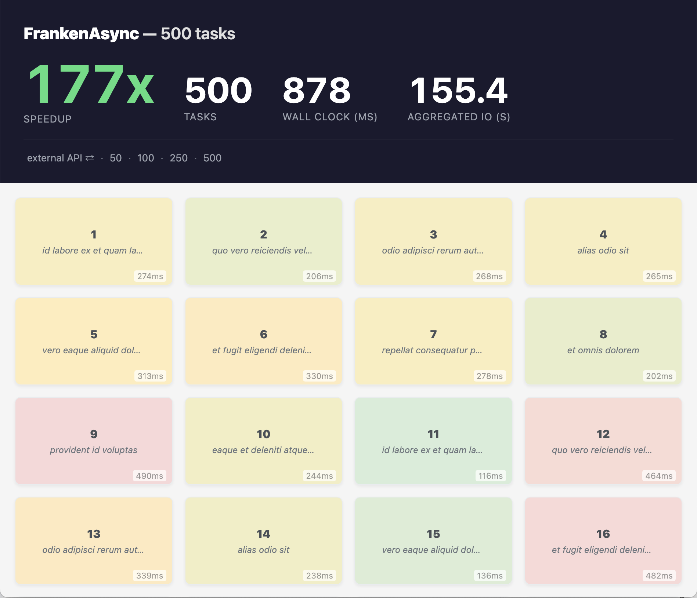

# FrankenAsync

Concurrent PHP using [FrankenPHP](https://frankenphp.dev) threads with a Go semaphore sliding window, 150x+ speedup with standard blocking PHP code.

FrankenAsync dispatches PHP scripts as internal subrequests to separate FrankenPHP threads — no HTTP overhead, true parallelism. A Go semaphore controls the sliding window — tasks beyond the limit queue and execute as slots free up. Works with ANY blocking PHP code, no rewrites needed.



> **Note**: This is a companion repo for my FrankenPHP conference talks. It's meant as inspiration and a reference implementation, not a production framework. Feel free to explore, fork, and adapt the patterns for your own projects.

### Talks

- [PHP 150x Faster, Still Legacy-Friendly](https://confoo.ca/en/2026/session/php-150x-faster-still-legacy-friendly) — ConFoo 2026 ([slides](https://gamma.app/docs/PHP-150x-Faster-Still-Legacy-Friendly-wozvte56hx7i0ku))
- [php[tek] 2026](https://phptek.io/) — Chicago, May 19-21

## How It Works

```
               PHP / Script::async()    Go / FrankenAsync         Go / FrankenPHP

              ┌────────────────────► ┌─────────────────────┐    ┌─────────────────┐
              │                      │                     │    │                 │
              │   task 1 ───────────►│   ╔═══╗  ╔═══╗      │    │   thread 1  ●   │
              │                      │   ║ 1 ║  ║ 2 ║   ───┼───►│   thread 2  ●   │
              │   task 2 ───────────►│   ╚═══╝  ╚═══╝      │    │   thread 3  ●   │
              │                      │                     │    │   thread 4  ●   │
     PHP      │   task 3 ───────────►│    running (W)      │    │                 │
  ──────────  │                      │                     │    └────────┬────────┘
  index.php   │    ...               │   ┄┄┄┄┄┄┄┄┄┄┄┄┄┄    │             │
              │                      │   ╎ 3 ╎ 4 ╎ ... ╎   │             │
              │   task N ───────────►│                     │             │
              │                      │    queued (N-W)     │             │
              │                      │                     │             │
              │                      └─────────────────────┘             │
              │                                                          │
              │◄─────────────────  Future::awaitAll()  ◄─────────────────┘
              │                     collect results
```

1. **PHP** calls `Script::async()` for each task
2. **Go task manager** queues tasks through a semaphore (limits concurrent PHP threads)
3. **FrankenPHP** executes each task on a separate thread
4. **PHP** calls `Future::awaitAll()` to collect all results

### Composition — Orchestrate, Don't Rewrite

The entire concurrency model builds on just two primitives — `Script::async()` and `Future`. From there, higher-level patterns are plain PHP generators that compose on top. No coroutine runtime, no event loop, no framework — just generators and threads.

```
  Script::async()  +  Future
         │
         ▼
  ┌──────┬──────────┬──────────┐
  │      │          │          │
 race  retry    parallel   throttle
```

Your existing PHP scripts — blocking DB queries, API calls, file I/O — stay exactly as they are. You add a thin orchestration layer on top:

```php
// product.php, reviews.php, stock.php — existing scripts, unchanged
function productPage(int $id): \Generator {
    [$product, $reviews, $stock] = yield from parallel([
        fn() => (new Script('product.php'))->async(['id' => $id]),
        fn() => (new Script('reviews.php'))->async(['id' => $id]),
        fn() => (new Script('stock.php'))->async(['id' => $id]),
    ], concurrency: 3);

    yield compact('product', 'reviews', 'stock');
}

// cart.php, stripe.php, paypal.php — existing scripts, unchanged
function checkout(int $cartId): \Generator {
    $cart = yield from retry(3,
        fn() => (new Script('cart.php'))->async(['id' => $cartId]));

    $payment = yield from race([
        (new Script('stripe.php'))->async($cart),
        (new Script('paypal.php'))->async($cart),
    ], "10s");

    yield $payment;
}
```

Mix, nest, and chain patterns freely — retry inside a race, throttle with parallel batches — using standard PHP control flow. The scripts are legacy. The orchestration is new. **You don't rewrite your PHP — you compose it.** The more code paths you can compose into parallel execution, the faster your application becomes — without changing a single line of existing code.

## FrankenPHP Fork

FrankenAsync requires a [fork of FrankenPHP](https://github.com/nicholasgasior/frankenphp) that adds APIs not available in upstream FrankenPHP. The `Frankenphp\Script` and `Frankenphp\Async\Future` PHP classes are implemented as a C extension that calls back into Go to reach the per-request task manager — upstream FrankenPHP doesn't expose the thread plumbing to make that possible.

FrankenPHP already provides `frankenphp.RegisterExtension(ptr)` to register C `zend_module_entry` extensions — FrankenAsync uses this to register the `Script` and `Future` PHP classes.

The fork adds:

| API | Language | Purpose |
|---|---|---|
| `frankenphp.Thread(index)` | Go | Retrieves a PHP thread by index, returning its `*http.Request` — which carries the request context where the task manager is stored |
| `frankenphp_thread_index()` | C | Returns the current thread's index from C code, so PHP extension methods can call `Thread(index)` to get back into Go |

The call chain:

```
PHP: (new Script('task.php'))->async(['id' => 1])
  → C:  PHP_METHOD(Script, async)          // phpext.c
  → C:  frankenphp_thread_index()          // gets current thread index
  → Go: go_execute_script_async(index,...) // phpext.go (CGO export)
  → Go: frankenphp.Thread(index)           // retrieves the request context
  → Go: asynctask.FromContext(ctx)         // gets the task manager
  → Go: manager.Async(runnable)            // executes on a new FrankenPHP thread
```

The fork is referenced via a `replace` directive in `go.mod`:

```
replace github.com/dunglas/frankenphp v1.11.3 => ../frankenphp
```

## Quick Start

### Prerequisites

- Go 1.26+
- The [FrankenPHP fork](https://github.com/nicholasgasior/frankenphp) cloned as a sibling directory (`../frankenphp`)

### Build PHP

FrankenAsync requires a ZTS (thread-safe) PHP build with embed support. The repo includes a Makefile that uses [static-php-cli](https://static-php.dev) to build PHP automatically:

```bash
make php     # Download static-php-cli + build PHP 8.3 (ZTS, embed)
make env     # Generate env.yaml from the PHP build
```

This builds a minimal PHP with the extensions needed for the demo. The PHP build is cached in `build/.php/` — subsequent runs skip the build if `libphp.a` exists.

To rebuild from scratch:

```bash
make php-clean   # Remove cached downloads and build artifacts
make php         # Rebuild
make env         # Regenerate env.yaml
```

### Build & Run

```bash
make build   # Build the binary (dist/frankenasync)
make run     # Build + start the server on :8081
make bench   # Build + run automated test suite
```

Build tag `nowatcher` is required (set via `GOFLAGS` in `env.yaml`).

### Manual Setup

If you prefer to use your own PHP build, create an `env.yaml` manually:

```yaml
HOME: "/Users/you"
GOPATH: "/Users/you/go"
GOFLAGS: "-tags=nowatcher"
CGO_ENABLED: "1"
CGO_CFLAGS: "-I/path/to/php/include ..."
CGO_CPPFLAGS: "-I/path/to/php/include ..."
CGO_LDFLAGS: "-L/path/to/php/lib -lphp ..."
```

The CGO flags must point to your PHP build's include headers and libraries. PHP must be built with ZTS (`--enable-zts`) and embed (`--enable-embed`).

### GoLand

Configure GoLand to load `env.yaml` as environment variables.

### Environment Variables

| Variable | Default | Description |
|---|---|---|
| `FRANKENASYNC_PORT` | `8081` | HTTP listen port |
| `FRANKENASYNC_THREADS` | `4 x CPU` | FrankenPHP thread pool size |
| `FRANKENASYNC_WORKERS` | `threads - 2` | Max concurrent subrequests (capped at threads - 2) |

### URL Parameters

| Parameter | Default | Description |
|---|---|---|
| `n` | `100` | Total number of tasks (comment fetches) |
| `local` | `1` | `1` = simulated I/O (usleep), `0` = real HTTP via local Go API |

Examples:
- `?n=100` — 100 tasks with simulated I/O (default)
- `?n=500` — 500 tasks, Go semaphore sliding window
- `?n=100&local=0` — 100 tasks with real HTTP calls to local Go API

## PHP API

### Script Execution

```php
use Frankenphp\Script;
use Frankenphp\Async\Future;

// Fire async subrequests
$task1 = (new Script('api/slow.php'))->async(['id' => 1]);
$task2 = (new Script('api/fast.php'))->async(['id' => 2]);

// Wait for all to complete
$results = Future::awaitAll([$task1, $task2], "5s");

// Sync execution
$result = (new Script('api/hello.php'))->execute();

// Deferred (starts on first await)
$task = (new Script('api/lazy.php'))->defer();
$result = $task->await("5s");
```

### Future Methods

```php
$task->await("5s");           // Wait for completion
$task->cancel();              // Cancel the task
$task->getStatus();           // Status enum
$task->getDuration();         // Execution time in ms
$task->getError();            // Error message if failed

Future::awaitAll($tasks, "30s"); // Wait for all
Future::awaitAny($tasks, "30s"); // Wait for first
```

### Structured Concurrency Helpers

Composable generators on top of `Script::async()` and `Future` — no coroutines, no event loop ([source](examples/lib/async.php)):

```php
use function Frankenphp\Async\{race, retry, parallel, throttle};

// Race: first wins, losers get cancelled
$result = yield from race([
    (new Script('primary.php'))->async(),
    (new Script('fallback.php'))->async(),
], "5s");

// Retry with exponential backoff
$result = yield from retry(3, fn() => (new Script('flaky.php'))->async(), "1s", 2.0);

// Parallel with sliding window concurrency limit
$results = yield from parallel($callables, concurrency: 5);

// Throttle — stream results in batches (generator)
foreach (throttle($allIds, 'task.php', batch: 50) as $result) {
    // process each result as batches complete
}
```

## Architecture

Concurrency is controlled through:

- **PHP thread pool** (`FRANKENASYNC_THREADS`, default `4 x CPU`) — fixed pool of FrankenPHP threads
- **Worker semaphore** (`FRANKENASYNC_WORKERS`, default `threads - 2`) — limits concurrent Go goroutines

Tasks exceeding the semaphore limit queue up and execute as slots become available (sliding window).

## Project Structure

```
frankenasync/
|-- main.go              # HTTP server, FrankenPHP init, request handling
|-- asynctask/           # Go task manager (async, defer, await, cancel)
|   |-- manager.go       # Task lifecycle, semaphore, goroutine pool
|   |-- manager_option.go # Configuration options
|   +-- context.go       # Request context helpers
|-- phpext/              # C + Go PHP extension
|   |-- phpext.go        # Go exports (script exec, task await, etc.)
|   |-- phpext.c         # PHP class registration (Script, Future)
|   |-- phpext.h         # PHP class declarations + arginfos
|   |-- phpext_cgo.h     # CGO bridge header
|   |-- util.c           # Exception helpers
|   +-- util.h           # Exception declarations
|-- examples/            # PHP demo pages
|   |-- index.php        # Main demo (thread dispatch)
|    |-- lib/
|   |   +-- async.php    # Structured concurrency helpers (race, retry, throttle)
|   +-- include/
|       +-- task.php     # Single blocking task
|-- build/
|   +-- php/
|       +-- Makefile     # PHP build via static-php-cli (ZTS + embed)
|-- bench.sh             # Automated test suite
|-- env.yaml             # IDE environment variables (generated by `make env`)
+-- Makefile             # Build targets
```

## License

Code is MIT — see [LICENSE.md](LICENSE.md). The [talk material](talk.md) is licensed under [CC BY 4.0](https://creativecommons.org/licenses/by/4.0/) — free to share and adapt with attribution.

## Postcardware

If you use this in a project or adapt the talk material, we'd love a postcard!

**Johan Janssens**
Ganzenbeemd 7
3294 Molenstede
Belgium
